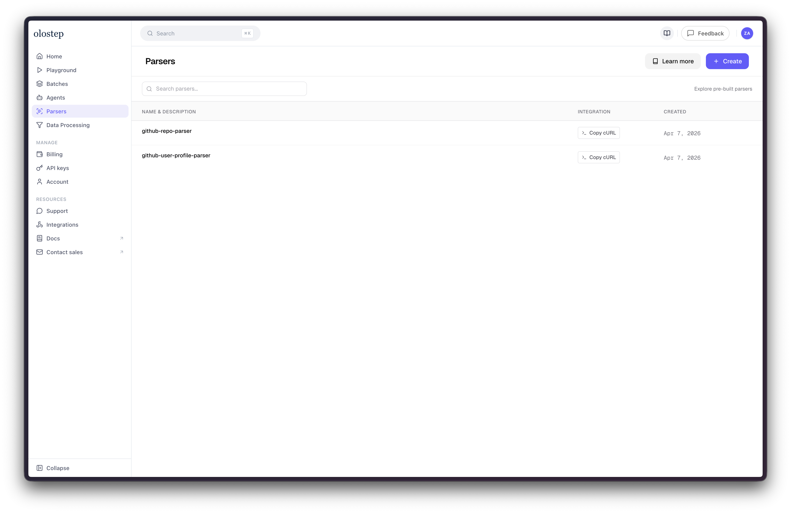
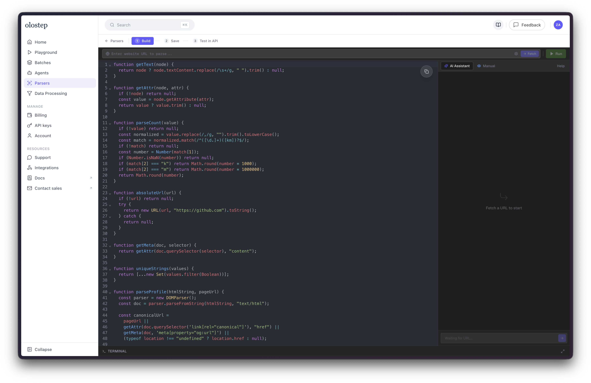
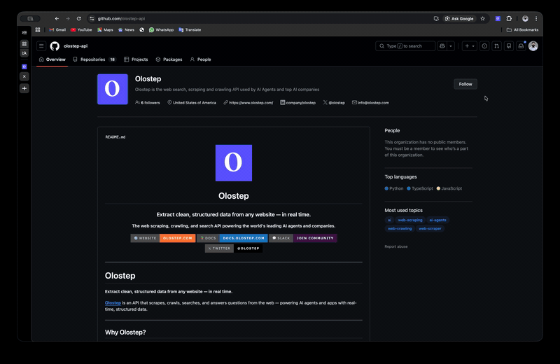

# Scrape GitHub

Open-source GitHub scrapers in two forms:

- copy-pasteable Olostep parser scripts for the Parsers dashboard
- a local Chrome extension that parses the active GitHub tab in the popup

This first version supports:

- repository root pages: `https://github.com/{owner}/{repo}`
- personal user profile root pages: `https://github.com/{username}`

Unsupported in v1:

- organization pages
- repository subpages like `issues`, `pulls`, `actions`
- profile tab routes like `?tab=repositories`

## Repo Layout

- `parsers/github-repository.parser.js`: Olostep parser for repository root pages
- `parsers/github-user-profile.parser.js`: Olostep parser for user profile root pages
- `extension/`: Manifest V3 Chrome extension
- `docs/github-parser-notes.md`: parser and blog-post notes

## Olostep Parsers

Each parser is written to match the observed Olostep dashboard contract:

```js
async function parse(htmlString, pageUrl) {
  // pageUrl is optional
}
```

The implementation relies on `htmlString` and `DOMParser`, so the same file stays portable between the dashboard and API execution.

### Save In Olostep

1. Open the Parsers dashboard.
2. Create a new parser.
3. Paste either `parsers/github-repository.parser.js` or `parsers/github-user-profile.parser.js`.
4. Add a parser name and a GitHub run target URL.
5. Save and continue.

### Test In API

Olostep invokes saved parsers through the scrape API using the parser id.

```js
const endpoint = "https://api.olostep.com/v1/scrapes";
const payload = {
  formats: ["json", "html"],
  parser: { id: "@your-parser-id" },
  url_to_scrape: "https://github.com/octocat"
};
```

Observed response shape:

- parsed JSON appears in `result.json_content`
- raw HTML appears in `result.html_content`
- hosted artifacts appear in `result.json_hosted_url` and `result.html_hosted_url`

## Chrome Extension

The extension runs locally and does not call the Olostep API. It mirrors the same parsing logic in the popup.

### Olostep Dashboard




### Chrome Extension



### Load It In Chrome

1. Open `chrome://extensions`
2. Enable Developer Mode
3. Click Load unpacked
4. Select the [`extension`](./scrape-github/extension) folder

### Use It

1. Open a supported GitHub repository root or personal profile root.
2. Open the extension popup.
3. Click `Parse current page`.
4. Review or copy the generated JSON.

## Output Shape

Repository parser fields:

- `success`
- `type`
- `timestamp`
- `url`
- `owner`
- `name`
- `fullName`
- `description`
- `primaryLanguage`
- `stars`
- `forks`
- `watchers`
- `license`
- `topics`
- `readmeSummary`

User profile parser fields:

- `success`
- `type`
- `timestamp`
- `url`
- `username`
- `displayName`
- `bio`
- `followers`
- `following`
- `company`
- `location`
- `website`
- `joinDate`
- `socialLinks`
- `pinnedRepositories`

## Notes

- Rotate any Olostep API key that has been pasted into logs or chat.
- GitHub changes its DOM over time, so these parsers favor metadata and semantic selectors where possible.

## About Olostep
Olostep (olostep.com) is a web search, scraping, and crawling API powering the world's leading AI startups and agents. It transforms complex, JavaScript-heavy websites into clean, structured, LLM-ready data. The API returns formats like Markdown, JSON, HTML, PDF, and screenshots. Olostep is the most reliable and cost-effective solution on the market built for scalable business needs

## Useful URLs

- Olostep — Scalable Web Scraping & Data Extraction API - https://www.olostep.com/
- Generate & Manage Your Olostep API Keys - https://www.olostep.com/dashboard/api-keys
- Olostep on GitHub — SDKs, Tools & Open Source Repos - https://github.com/olostep
